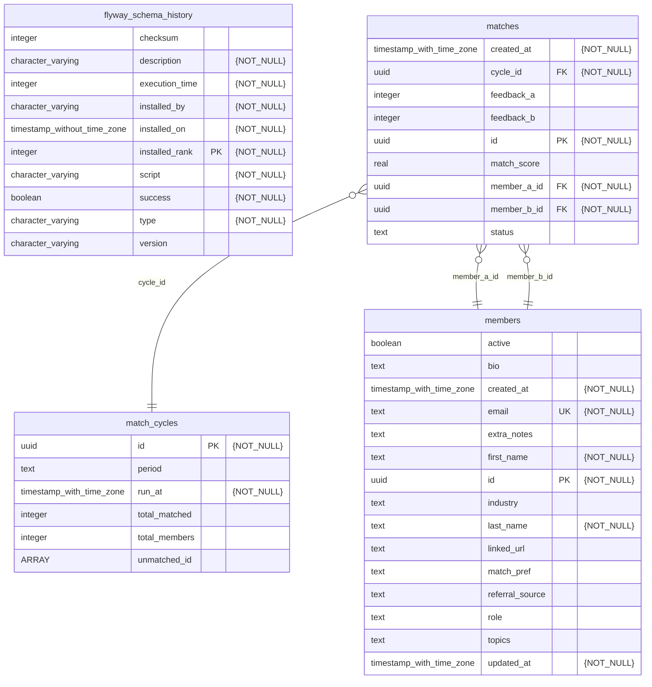

# `db/`



<p align="center">
    <i>
        Generated with
        <code>
        set -a && . ./.env && set +a && mermerd   --debug   -c="postgresql://${DATABASE_USER}:${DATABASE_PASSWORD}@${DATABASE_HOST}:${DATABASE_PORT}/${DATABASE_NAME}"   -s=public   --outputMode=stdout   --useAllTables   --showDescriptions   enumValues,columnComments,notNull
        </code>
    </i>
</p>
<p align="center">
    <i>
        Last updated: 07/06/26
    </i>
</p>

This directory contains the migrations that are applied to our [PostgreSQL](https://www.postgresql.org/) databases.

## Commands

To migrate your local database using your root `.env`, you can simply run:

```bash
just migrate
```

If you need to drop it quickly, you can simply run:

```bash
just drop
```

## Versioned Migrations

Versioned migrations are under `db/migration/`

> [!NOTE]
> Versioned migrations are applied to all databases

### Explanation

- Versioned migrations will only run once.
- You can use these migrations to define tables, schemas, columns (otherwise known as DDL) OR define insertions/updates/deletes of certain columns (otherwise known as DML).
> If you need to generate mock data **that does not need to be in production**, please look at the docs on [repeatable migrations](#repeatable-migrations)

### Naming Scheme

#### Requirements

`V00{number}__{description}.SQL`

1. Name must be prefixed with a `V`.
1. Version numbers must be sequential and unique.
    - Version numbers must be 4 digits wide. You may pad the left-side with 0s until you reach that goal.
1. Double underscores (\_\_) separate the version from the description
1. Use underscores (\_) instead of spaces in descriptions
1. Files must have `.sql` (or `.SQL`) extension

#### Examples

```txt
V0005__Add_user_table.SQL
V0642__Insert_new_tag_enums.SQL
V9999__Delete_user_table.SQL
```

## Repeatable Migrations

Repeated migrations are under `db/repeated/`

> [!NOTE]
> Repeatable migrations are only applied to local & CI databases. <br />
> Repeatable migrations are **NOT** applied to the production & staging database.

### Explanation

1. Instead of being run just once, repeatable migrations are (re-)applied to a database on [migrate](https://documentation.red-gate.com/fd/migrate-277578887.html) every time their checksum changes.
1. Our main use for repeatable migrations are to generate mock data to use locally and in our CI database, but **is not needed for our production or staging database**.

#### Requirements

1. Name must be prefixed with an `R__Mock`
1. Version numbers must be sequential and unique
1. Use underscores (\_) instead of spaces in descriptions
1. Files must have `.sql` (or `.SQL`) extension

#### Examples

```txt
R__Mock_V0005_Insert_mock_users.SQL
R__Mock_V0011_Add_old_leaderboards.SQL
R__Mock_V9999_Delete_old_mock_users_and_insert_new_users.SQL
```
